# Kick the Fly

A kick-the-buddy game whose buddy is a real fruit fly brain: all **166,700 neurons of the MaleCNS v1.0 connectome**, simulated live while you
throw, swat, burn, freeze and feed it to a spider, or reward it with sugar. Every hit lands on the fly's real sensory neurons, and what it does
next is read from its real descending neurons. Switch to **Lab mode** and the same brain becomes a research bench: validation against published
experiments (including the ones it fails), assays, classic behavior rigs, a virtual patch clamp, calcium imaging, and protocols that run headless.

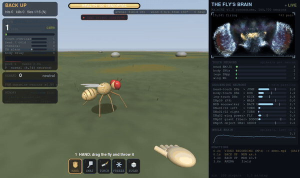

*The open field in first person: a swat and the blowtorch fire the fly's real touch and heat neurons, and the panel on the right shows its whole
brain responding. Recorded with the in-game video recorder (Shift+R).*

## Download

| | |
|---|---|
| **Windows** | **[KickTheFly.exe](https://github.com/legendarylolo318-cloud/kick-the-fly/releases/latest/download/KickTheFly.exe)** (about 90 MB). Double-click it: nothing to install, the whole brain is inside. It isn't code-signed, so SmartScreen may warn: **More info**, then **Run anyway**. |
| **Linux** | **[KickTheFly-x86_64.AppImage](https://github.com/legendarylolo318-cloud/kick-the-fly/releases/latest/download/KickTheFly-x86_64.AppImage)** (about 110 MB). `chmod +x` it and run it. Built on Ubuntu 22.04; Wayland or X11; no FUSE? add `--appimage-extract-and-run`. A Flatpak manifest is in `packaging/flatpak/`. |
| **From source** | Any OS with Python 3.11+: [docs/running-from-source.md](docs/running-from-source.md). That's how you get the faster Numba and GPU backends, the Python API and NWB export. |

Each release lists `SHA256SUMS`. The 3D game needs OpenGL 3.3; without it the game says why and starts the 2D version (`--2d`). Run
`--selftest` (or Settings > Help) to check an install; it explains how to fix whatever it finds and changes nothing.

## New in 3.0

<table>
<tr>
<td width="50%">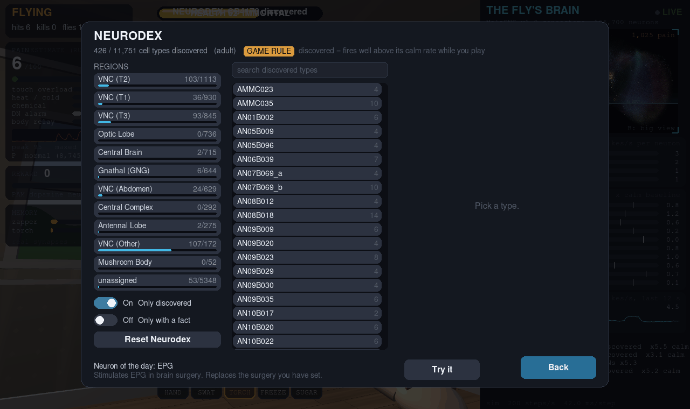<br><b>Neurodex.</b> Collect the cell types your fly fires, each with the dataset's numbers and, for curated ones, a cited fact.</td>
<td width="50%">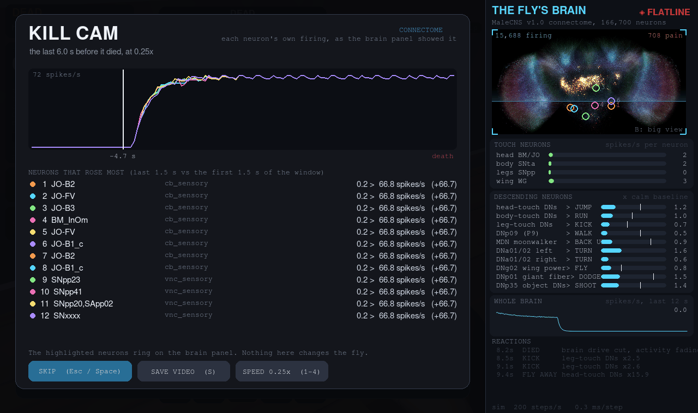<br><b>Kill cam.</b> The last seconds of its brain, replayed in slow motion, with the neurons that rose most.</td>
</tr>
<tr>
<td>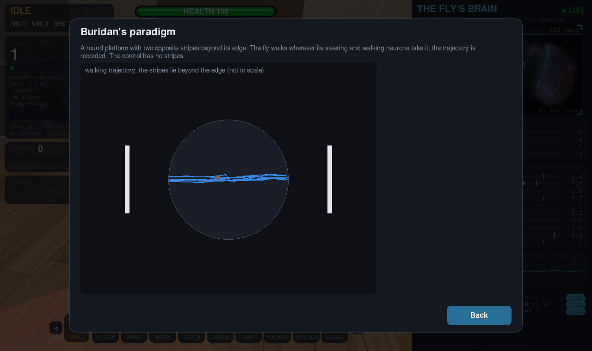 Behavior rigs: a fly's walking path between two stripes in Buridan's paradigm"><br><b>Behavior rigs.</b> A tethered flight simulator, a fly on a ball, Buridan's paradigm and an olfactory arena, each with a pre-registered assay. Three reproduce the classic result; the olfactory arena does not, and says so.</td>
<td>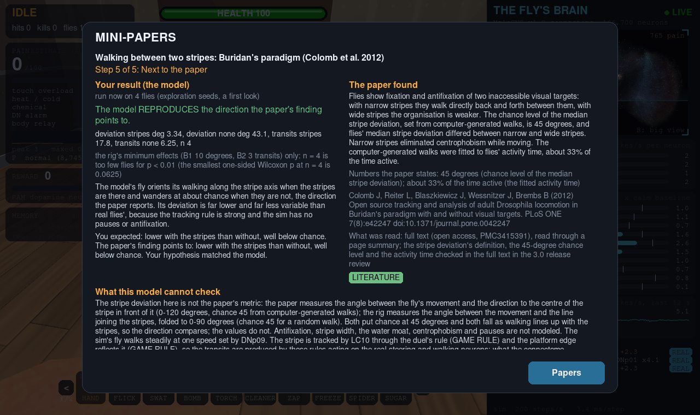<br><b>Mini-papers.</b> Six classic papers as guided experiments: state a hypothesis, run it, and read your result next to what the paper states.</td>
</tr>
<tr>
<td>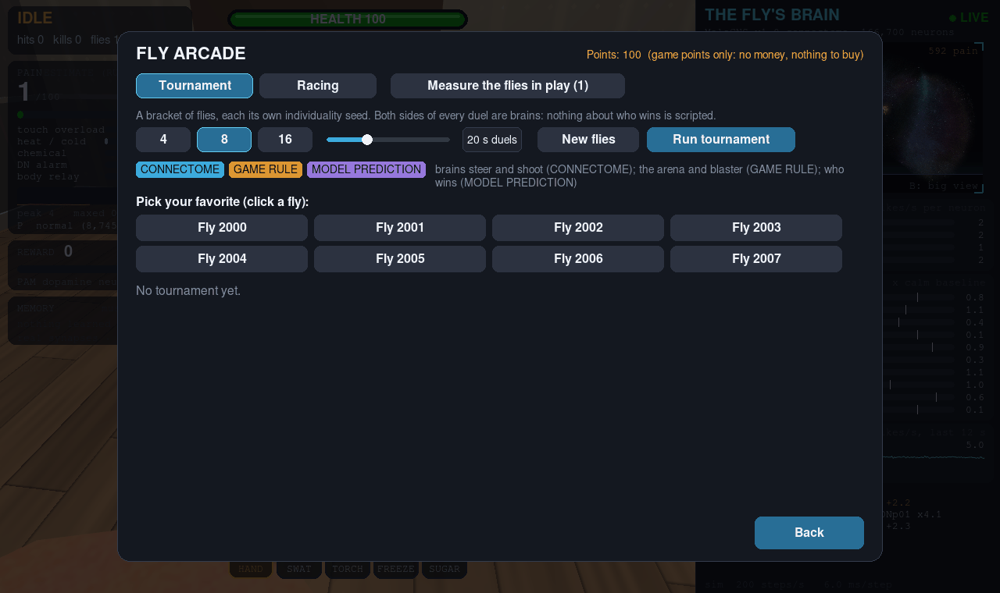<br><b>Fly arcade.</b> Tournaments and races where every fly is its own brain. In-game points only: no money, nothing to buy.</td>
<td>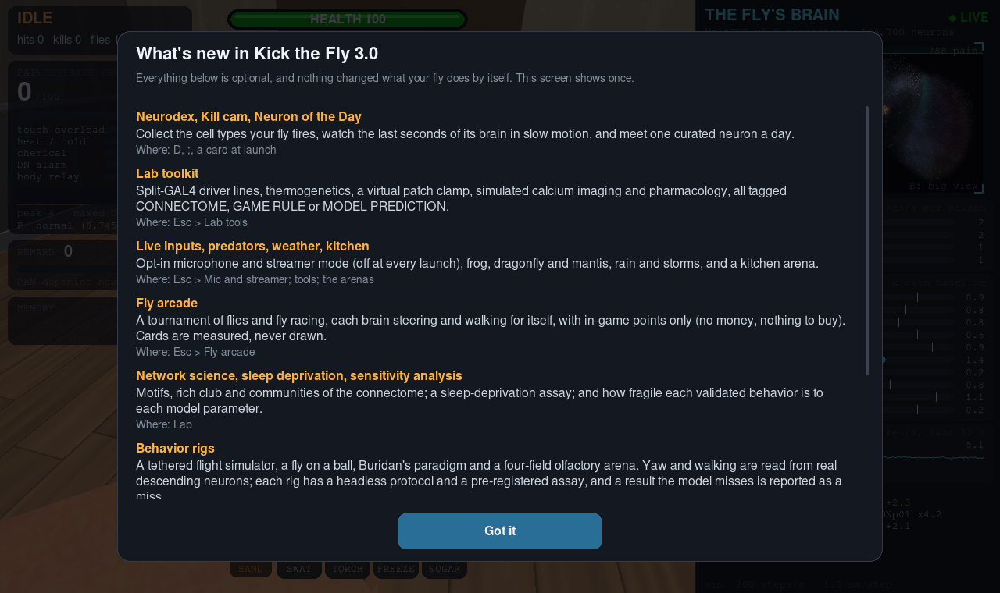<br><b>And more.</b> Predators, rain and storms, a kitchen arena, an opt-in microphone and Streamer mode, a genetic toolkit, thermogenetics, a patch clamp, calcium imaging, pharmacology, network science, sleep deprivation and a sensitivity analysis.</td>
</tr>
</table>

**What did not change: the simulation.** `--validate` gives the same results as 2.13 (21 tests, **12 PASS / 9 FAIL**), and no weight, time
constant or threshold was tuned to make anything pass. Old saves, settings, pet files, replays and protocols keep working. Everything new is
tagged **CONNECTOME**, **GAME RULE** or **MODEL PREDICTION**. The whole release: [docs/changelog.md](docs/changelog.md); how it was checked, the
decisions and the known limits: [docs/3.0-review.md](docs/3.0-review.md).

## Play

First person in a 3D living room (or `--2d` for the original game). Walk up and use a tool, or walk into the fly to kick it.

- **Hits fire real sensory neurons**: head bristles and Johnston's organ, body touch, leg proprioceptors, wing sensors; the blowtorch fires heat
  sensors, the freeze spray cold sensors, the brake cleaner smell and taste neurons, the zapper every touch neuron.
- **Its reactions are its descending neurons**: running, kicking, walking, backing up (the moonwalker neurons), turning (DNa01/DNa02), taking
  off (DNg02). Move a tool at it fast and its looming detectors LPLC2 and LC4 fire the giant fiber, and it dodges. Sneak up slowly and it won't.
- **It learns** with its real mushroom body: pair a smell with pain or sugar and dopamine reshapes the actual Kenyon-cell-to-output synapses.
- **Ten arenas**: the room, fan, flypaper, pool, lamp, a thermal gradient, an escape room, the kitchen, and outdoors an open field with wind and
  sun and an orchard where flies fly to fruit and feed.
- **Up to 16 flies** on the plain backend (more with Numba or a GPU), each a complete independent brain; they notice each other only through
  their real looming and touch neurons.
- **Brain surgery, a neuron inspector, a 1v1 duel** in which the fly aims with LC10 and shoots with DNp35, **challenges**, a **Pet mode** with
  one persistent fly, slow motion, save states, screenshots, GIFs and video.

Controls (all rebindable, gamepad included), settings, loadouts, challenges and file locations: **[docs/playing.md](docs/playing.md)**.

| | |
|---|---|
| 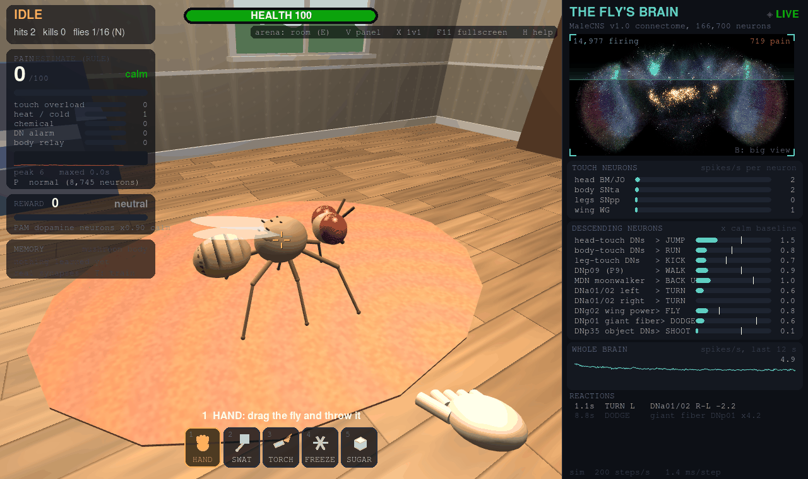 | 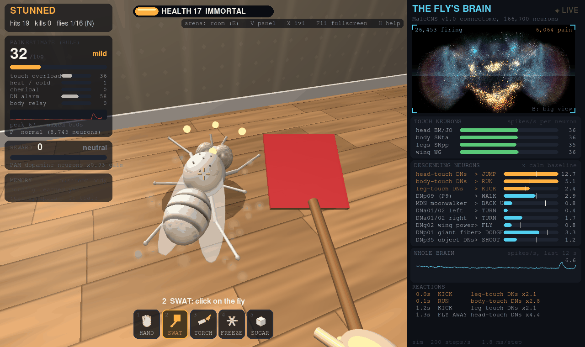 |
| **The room**, first person, with the live brain on the right. | **Swatting**: the touch neurons fire, then the leg-touch descending neurons kick. |
| 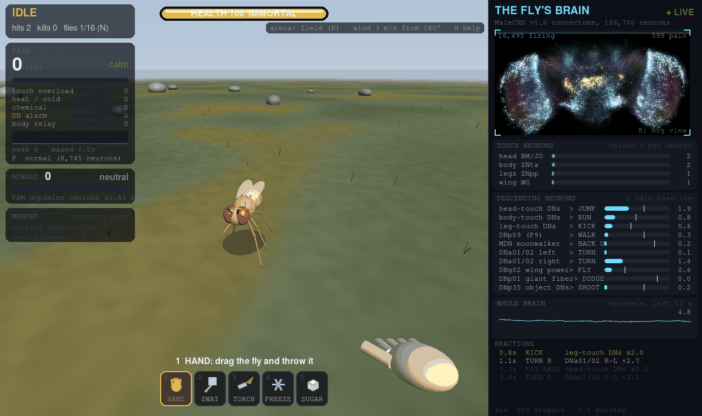 | 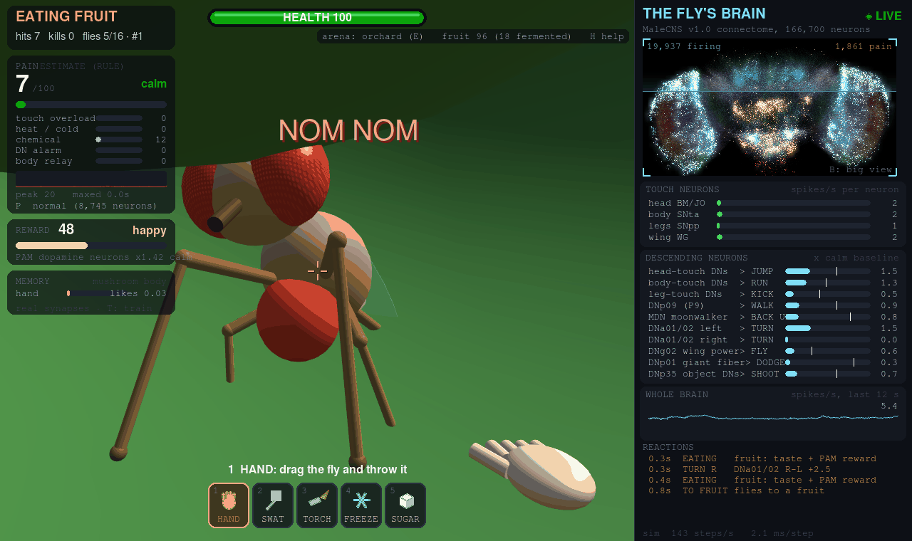 |
| **The open field**: wind drives its real antennal wind neurons. | **The orchard**: flies fly to fruit, land and feed. |
| 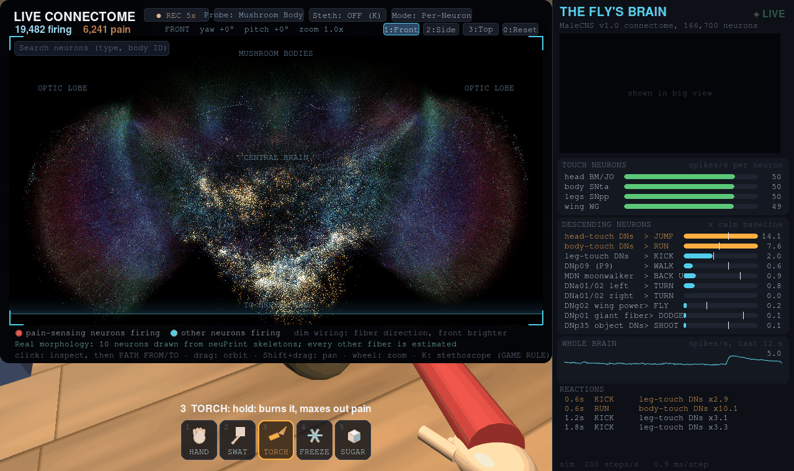 | 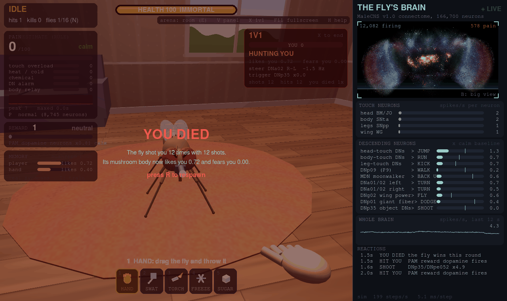 |
| **The big brain view** under the blowtorch: the heat-sensing neurons and everything downstream. | **The 1v1 duel**: it aims through LC10 and its steering neurons, and shoots through DNp35. |
| 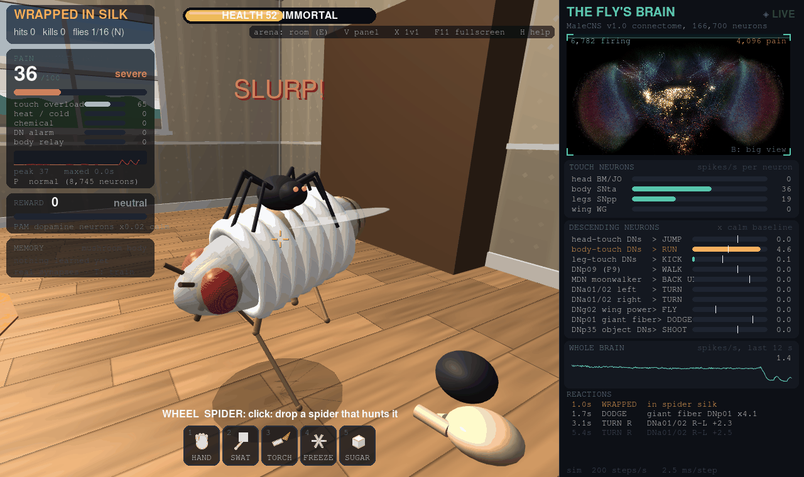 | 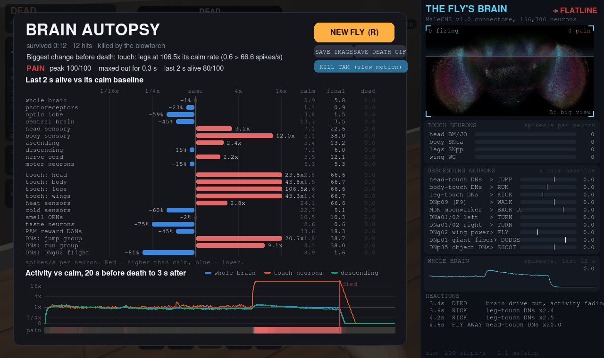 |
| **A spider** bites (body and leg touch neurons) and wraps it. | **Autopsy**: every brain region's last 2 s alive against its calm baseline. |

More pictures (flypaper, the lamp, the thermal arena, the escape room, surgery, training, the inspector, the path tracer, the decoy, the laser,
the see-through panel, settings): [docs/gallery.md](docs/gallery.md).

## Lab

Esc > Mode > Lab replaces the challenges with research tools: the validation dashboard, assays over many flies with same-seed controls and
statistics, psychometric sweeps, the optogenetics laser, recording with NWB export, a critical path finder, robustness tests (synapse thresholds,
transmitter sign flips), neural clamp, diff mode, classroom lectures, the 3.0 toolkit and rigs, and YAML protocols that also run headless
(`--headless --protocol FILE`). All of it, with examples: **[docs/lab.md](docs/lab.md)**.

| | |
|---|---|
| 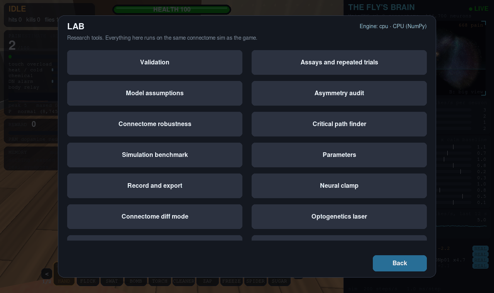 | 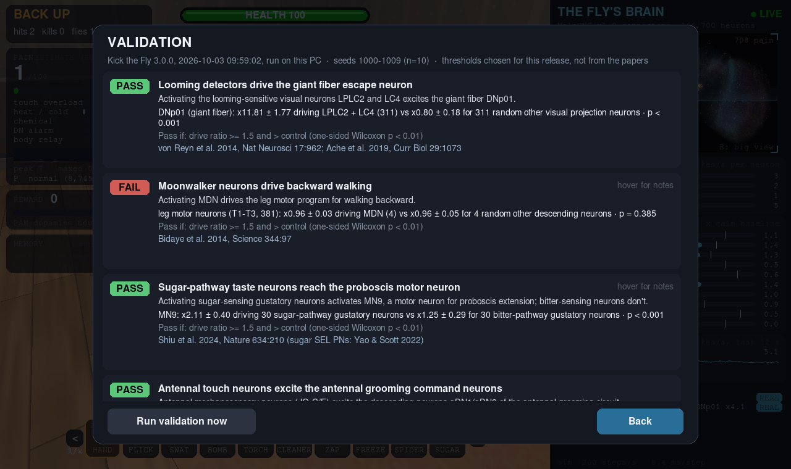 |
| **Lab mode**, with the simulation engine shown top right. | **Validation**: which published fly results it reproduces, with numbers, and which it doesn't. |

From a source checkout the brain is also a Python library ([docs/api.md](docs/api.md), with a [notebook](docs/api_example.ipynb)):

```python
from kickthefly import Fly

fly = Fly(seed=1000)
rec = fly.record({"giant fiber": "dnp01"})
fly.step(2.0)
fly.drive("loom")           # LPLC2 + LC4, like optogenetic activation
fly.step(2.0)
print(rec.rates(0, 2), rec.rates(2, 4))
```

## Validation

Does it reproduce published fly experiments? Each test drives a set of neurons for 2 s on held-out seeds (1000-1009) next to a matched control,
with pass criteria fixed before the run: at least 1.5x the calm rate and above the control, one-sided Wilcoxon p < 0.01, n = 10.

| passes | fails |
|---|---|
| looming detectors -> giant fiber (x11.81 vs x0.80) | MDN -> leg motor neurons, i.e. backward walking (x0.96 vs x0.96) |
| sugar taste neurons -> proboscis motor neuron MN9 (x2.11 vs x1.25) | aDN -> front-leg motor neurons (x1.13, too weak) |
| antennal touch -> grooming command neurons aDN (x4.87 vs x0.85) | E-PG head-direction bump, from a wedge or from wind |
| T-maze odor + shock conditioning (PI 1.00 vs -0.03) | P1 -> ps1 wing motor neurons (x1.43, too weak) |
| song neuron pIP10 -> ps1 wing motor neurons (x1.93 vs x0.94) | grooming hierarchy, head over abdomen (Seeds et al. 2014) |
| optomotor: rightward motion -> right steering DNs (x2.72 vs x0.80), through a game-rule motion stage | foreleg pheromone GRNs -> P1 cluster (x1.20, too weak) |
| cVA: DA1 ORNs (Or67d) -> DA1 projection neurons (x2.58 vs x0.80) | mushroom body extinction (PI 1.00 after vs 1.00 without) |
| cVA: DA1 PNs -> lateral horn / aSP targets (x2.22 vs x0.96) | second-order conditioning (odor B PI 0.00 vs -0.03 unpaired) |
| one-synapse activation (not avoidance): bitter -> DNg28, CO2 -> V PNs, hot -> VP2 PNs, cold -> VP3 PNs | |

The full table with SDs, controls, citations and what each failure means: **[docs/validation.md](docs/validation.md)**. The 3.0 rigs add
pre-registered assays on top ([docs/rigs.md](docs/rigs.md)): tethered flight, the ball and Buridan's paradigm pass, the olfactory arena fails.

## Connectome or game rule

A game needs rules the wiring can't supply. Everything is tagged, on screen and in the docs:

| comes from the connectome | is a game rule |
|---|---|
| The spiking model (leaky integrate-and-fire over the brain pack's 10.3 million signed connections) and all firing | Which move each descending-neuron group triggers, and every threshold (Lab > Parameters) |
| Which sensory neurons each hit, tool, arena, scent or taste drives | The body: ragdoll physics, flight paths, damage, death, the pain index (no neurons are annotated as nociceptors) |
| The descending neurons read for reactions (jump, run, kick, walk, back up, turn, take off) | How looming reaches LPLC2/LC4 (an object's growth in view), the optomotor motion stage in front of T4/T5 |
| Looming detectors exciting the giant fiber, sugar neurons reaching MN9, antennal touch reaching the grooming neurons (all validated) | Sugar driving the PAM reward neurons directly, pain driving PPL1 punishment, each tool having a smell |
| The learning: dopamine reshaping the real Kenyon cell to MBON synapses, with the connectome's own dopamine-to-MBON map | The learning rate and forgetting, the T-maze's choice rule, alcohol's inebriation (no neuron is intoxicated) |
| In the duel and the rigs: aiming and turning from DNa01/DNa02, shooting from DNp35, walking from DNp09 | The duel's blaster and arena, the rigs' platforms, balls and arenas, LC10 tracking of a target |
| The Neurodex entries' numbers, the kill cam's replayed firing | What counts as a discovery, the kill cam window, every UI choice |

The complete list: **[docs/connectome-and-game-rules.md](docs/connectome-and-game-rules.md)**. The canonical map is the docstring at the top of
`kickthefly/game/kick_the_fly.py`.

## Performance

One fly keeps real time (200 brain steps/s) on any backend. With many flies Numba scales best on the CPU and PyTorch GPU backends run them
batched; the OpenGL `gl` backend runs on any vendor's GPU and steps a process's flies together. NumPy, Numba and torch-cpu give spike-for-spike
identical results; GPU backends agree statistically. The exe and AppImage use NumPy. Tables and methods: [docs/performance.md](docs/performance.md).

## Repository

```
kick_the_fly.py      launcher: python kick_the_fly.py ... (python -m kickthefly runs the same game)
kickthefly/          the package: core/ (settings, saves, paths, version), sim/ (connectome, brain pack, LIF simulator),
                     game/ (2D game, 3D room, tools, arenas, rigs), ui/ (menus), lab/ (validation, assays, protocols, Lab pages), data/
tests/ protocols/ docs/ packaging/ tools/
data/                not in git: the connectome download and the brain pack (built from source, bundled in the exe and AppImage)
```

Contributing (layout, tests, screenshots, translations): [CONTRIBUTING.md](CONTRIBUTING.md). History: [CHANGELOG.md](CHANGELOG.md). If you use Kick the
Fly in research or teaching, cite it with [CITATION.cff](CITATION.cff) and cite the MaleCNS v1.0 connectome.

## Credits

The adult connectome data is Janelia FlyEM MaleCNS v1.0, a collaboration between HHMI Janelia, the University of Cambridge, the MRC Laboratory of Molecular Biology and Google Research. It is licensed [CC BY 4.0](https://creativecommons.org/licenses/by/4.0/) and available at [male-cns.janelia.org](https://male-cns.janelia.org/download/).

The Drosophila larva connectome data is from Winding, M., Pedigo, B.D., Barnes, C.L., et al. (2023). "The connectome of an insect brain." *Science*, 379(6636), eadd9330. DOI: [10.1126/science.add9330](https://doi.org/10.1126/science.add9330) (Supplementary Data S1). No license is stated for it, so Kick the Fly does not redistribute it: the larva pack is built on your machine from the downloaded Data S1 (checksum-verified; mirror: [github.com/brain-networks/larval-drosophila-connectome](https://github.com/brain-networks/larval-drosophila-connectome)).

The exe and AppImage bundle a compact pack derived from the adult data only. The pack keeps the signed synapse counts, the neuron labels (type, superclass, subclass, instance), body IDs and the cell-body positions, and is otherwise unmodified.
