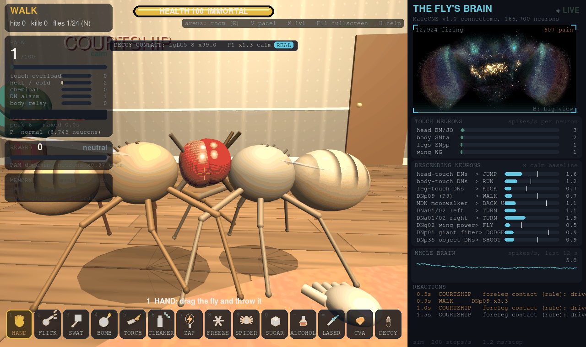

# Playing Kick the Fly

Everything the game does, its controls and settings, and where it keeps your files. The [README](../README.md) has the short version; the Lab's
research tools are in [lab.md](lab.md), and what comes from the connectome versus what is a game rule is in
[connectome-and-game-rules.md](connectome-and-game-rules.md).

## What you can do

The 3.0 features (Neurodex, kill cam, Lab toolkit, predators, weather, the kitchen, the fly arcade, behavior rigs, mini-papers and more) each have their own page, listed in [changelog.md](changelog.md).

- **Tool loadouts:** the hotbar is a short list of tools on keys 1-9 and 0 (Base, Chaos, Chemist, Lab, All, Pet or your own, up to five saved), with a loadout editor (Q) and a tool wheel (hold `) that reaches every tool. See [Tool loadouts](#tool-loadouts) and [loadouts.md](loadouts.md). A new **fruit** tool is eaten exactly as sugar is.
- **Self-test, bug report and tutorial:** `--selftest` (also Settings > Help) checks your install and says how to fix what it finds; Report a bug shows exactly what a report would contain and never sends anything; a one-minute tutorial runs on the first launch. See [selftest-and-bugreport.md](selftest-and-bugreport.md).
- **Playthrough bot and CI:** `--headless --playthrough` uses every tool in every arena on both brains and checks the documented neurons fired; it runs nightly with the full validation and its history is published. See [playthrough.md](playthrough.md) and [ci.md](ci.md).
- **Larval brain (headless):** the *Drosophila* larva brain connectome (2,952 neurons, 352,611 synapses; Winding et al. 2023) for `--headless --validate --brain larva` and Python use. It is built on your machine from the paper's Data S1 on first use. The windowed larva game is not finished: with `--brain larva` the game still runs the adult. Neither larva validation test passes. See [larva.md](larva.md).
- **Fly individuality:** per-fly variation as per-neuron scaling $W_{\text{fly}} = D_{\text{post}} \cdot W \cdot D_{\text{pre}}$ with the shared matrix unchanged (Settings > Brain > Individuality: off / subtle / strong). NumPy and Numba stay bit-exact; torch-cpu only with it off; gl applies it too since 3.1.0 (to float32 summation order). Forced off for validation. Personality cards are measured from each fly's own brain (Esc > Fly arcade > Measure the flies in play); an unmeasured fly says "card not measured". See [individuality.md](individuality.md).
- **Puppeteer (3.1.0):** Esc > Challenges. A puzzle mode in which you can't hit the fly: the laser is your only tool and you steer it by switching its real cell types on and off. Ten levels with a par and the circuit that solves each. See [puppeteer.md](puppeteer.md).
- **Lesion battles (3.1.0):** Esc > Fly arcade > Lesion battle. Two players on one screen each silence or stimulate up to 3 cell types in their own fly (500 neurons at most), then the flies duel best of 3, with a replay. Loadouts save and share as surgery codes. The surgery's effect is CONNECTOME; the budget, cap and arena are GAME RULE; who wins is a MODEL PREDICTION. [lesion-battle.md](lesion-battle.md)
- **Contraption builder (3.1.0):** Esc > Challenges > Contraption builder. Place parts on a bench and wire them on channels; the machine fires the game's own tools at a (by default tethered) fly. Builds share as contraption codes. [contraption.md](contraption.md)
- **Pet mode:** one persistent fly across real days in `Esc > Mode`. No background process, service, autostart or timer: time is caught up deterministically at launch, clamped to 0-7 days. Hunger and sleep pressure (GAME RULE, in Lab > Parameters) scale real taste, PAM reward and dFB sleep neurons. Death is off by default. See [pet.md](pet.md).
- **Hits fire real sensory neurons:**
  - head: head bristles and Johnston's organ
  - body: tactile neurons
  - legs: proprioceptive neurons
  - wings: wing sensory neurons
  - blowtorch: heat-sensing neurons
  - brake cleaner: smell and taste neurons (and it dissolves the fly)
  - freeze spray: cold-sensing neurons
  - zapper: every touch neuron plus a shock through its brain
  - spider bites: body and leg touch neurons
- **Its reactions come from its descending neurons:** running, kicking, walking, backing up and turning.
- **It can fly:** it takes off when its DNg02 wing-power neurons fire above normal, and flies away when its head-touch escape neurons fire.
- **Pain meter:** built from touch overload, heat and cold sensors, chemical senses and descending-neuron alarm. The **blowtorch** and **brake cleaner** max it out.
- **More pain neurons (P):** the wiring can't gain neurons, so the pain setting listens to more of the fly's real ones. **Normal** uses 9,080. **More** uses 11,392 and adds the rest of the body's sensory neurons. **Max** uses 13,238 and adds the ascending neurons that relay body signals to the brain. Higher settings also make each hit fire more of them.
- **Immortal mode (I):** it feels everything but can't die. It heals when you stop, and breaks out of spider silk.
- **Reward:** drop **sugar** and it walks over to eat. That lights up its PAM dopamine reward neurons and heals it. Its sugar-pathway taste neurons fire its proboscis motor neuron MN9, and when MN9 responds its proboscis comes out.
- **Alcohol (-):** drop a droplet of fermented fruit and the fly walks over and sips it. Drinking drives its real sweet taste pathway and its PAM dopamine reward neurons, the same ones sugar does, and its smell comes through the real fermentation glomeruli (DM1, DM2, DP1m). Getting drunk is a **game rule**: an inebriation level builds up with every sip and wears off over about 45 seconds, and while it lasts the game gives the fly tremors, a stumbling gait, wobbly flight and slower escape reflexes. No neuron in the simulation is actually intoxicated.
- **Death and autopsy:** it can die. The autopsy compares every brain region's last 2 s alive with its calm baseline, and shows pain on a timeline.
- **It sees you coming:** move a weapon at it fast and its real looming detectors (LPLC2 and LC4) fire its giant fiber escape neuron, so it dodges. Sneak up slowly and it won't notice.
- **Brain surgery (O):** silence or stimulate real neuron groups and watch what happens. Switch on the moonwalker neurons and it backs up; silence the giant fiber and it can't dodge.
- **Neuron inspector:** in the big brain view, click any neuron to see its type, how fast it's firing, and its strongest connections in the connectome.
- **1v1 duel (X):** the fly gets a blaster and can kill you, and every part of the fight runs through its brain:
  - it sees you through its real target-tracking neurons (LC10), which steer it toward you through its steering neurons (DNa02);
  - it shoots when its small-object detectors fire its DNp35 neurons;
  - landing a hit fires its reward dopamine neurons, so it learns to like hunting you;
  - hurting it fires its punishment dopamine neurons, so it learns to fear you, and it runs away and stops shooting.

  Silence its tracking neurons in brain surgery and it can't aim.
- **Multiple flies (N):** press N to spawn another fly, each running its own complete, independent connectome — 166,700 neurons apiece. Up to 16 flies on plain NumPy (the exe and AppImage), one per CPU core (16-32) with the optional Numba backend, or 32 on a GPU backend (see [performance.md](performance.md)); each needs about 350 MB of free memory. They notice each other for real: a fly closing in fast fires another's actual looming detectors (LPLC2/LC4) and makes it dodge, and bumping into each other fires real touch neurons. Press **F** to pick which fly the brain panel, surgery and training follow (for 5 s; otherwise they follow the fly nearest you). Only the original fly's mushroom-body learning is saved between sessions. Every fly is its own brain thread, so with many flies the brains can fall behind real time (see Performance).
- **Real training (T):** the fly learns with its actual mushroom body. Pair a smell with a shock or with sugar and dopamine weakens the real Kenyon cell to output neuron synapses for that smell, just like in real flies. The Training panel runs lab-style conditioning and graphs the learning curve. Memory is saved between flies and sessions (see [File locations](#file-locations)). Hurting the fly while it smells a tool trains it too.
- **Arenas (E):**
  - **fan:** wind that fires its wind-sensing neurons, which excite its antennal grooming command neurons
  - **flypaper:** it gets stuck and struggles
  - **pool:** it floats, gets wet wings, and can drown
  - **lamp:** it's drawn to the light and singes itself on the bulb
  - **thermo** (2D and 3D): the floor runs from cold (15 °C, left) to hot (35 °C, right). Its real cold- and hot-sensing antennal neurons fire more the further it is from the comfortable middle, and the extremes hurt it. It doesn't seek the middle on its own: the temperature is a **game rule** reaching real neurons, and the neurons it reaches are validated only as one-synapse activation.
  - **escaperoom:** multi-hazard gauntlet combining fan wind, flypaper strip, and hot lamp overhead; reach the sugar dish to stop the speedrun timer and generate a tamper-evident verification code (`KTF-<SEED>-<TIME>-<SIG>`).
  - **open field** (3D): 30 m by 30 m of grass, rocks and open sky. A steady wind drives its real wind-sensing antennal neurons and the sun drives its photoreceptors; wind direction and strength and the sun's position are Lab parameters. Wind also reaches its head-touch escape neurons, so in a breeze it keeps flying off, and outdoors an escape really goes somewhere: fly out of sight (26 m from you, or 15 m up) and it's **lost**. **J** calls it back.
  - **orchard** (3D): a grove of 24 fruit trees. The fly flies to a ripe fruit, lands and feeds, which drives the same real taste and PAM reward neurons sugar does and heals it. Each fruit holds a few feeds and shrinks and browns as it's eaten, then drops; it grows back after about 75 s, staggered, with a cap per tree. Some fruit are fermented and act like the alcohol tool. The fruit, the trees and the flying to them are **game rules**: the fly doesn't forage through its own circuitry. With several flies they end up competing for fruit, but only through the looming and touch neurons they already have; nothing about competing is scripted.

  - **day and night** (outdoors, off by default: Settings > Brain > Day/night cycle): the sun circles, night falls, and daylight drives its photoreceptors and its morning clock neurons (l-LNv, s-LNv). The cycle and that direct link are game rules. There's a **SLEEP** readout on its dorsal fan-shaped body (FB6/FB7), but in testing a whole day never moved those neurons enough, so it only sleeps when you stimulate them in brain surgery.

  - **kitchen** (3D): the countertop is the floor, with a fruit bowl (the orchard's feeding), a vinegar trap whose scent pokes the fermentation glomeruli DM1/DM2/DP1m (the fly goes to it only when those neurons fire for the smell; hover over the mouth and it is stuck), a sink (the pool's water in a basin), a stove burner (the lamp's heat) and a cook who swats at where a fly was, slowly enough to be seen coming. All **game rules** on the neurons the fly already has. [kitchen.md](kitchen.md)
  Open field, orchard and kitchen need the 3D game; the 2D game stays indoors and says so. The arena you pick is saved in `config.toml` (Settings > Brain > Arena, or **E**), in save states and in every export's metadata.
- **Save and share:** **F12** (3D) or **S** (2D) saves a screenshot and **G** saves a GIF of the last 6 seconds. **Shift+R** starts a **video** of any length and Shift+R again stops it: an MP4 if [ffmpeg](https://ffmpeg.org/) is installed (on your PATH), otherwise a GIF (smaller, up to 60 s). It plays back at real speed however fast the game draws, and a red badge shows how long you've been recording. `--record-video [PATH]` starts one at launch. **L** toggles time-lapse recording (2x, 5x, 10x or 20x speed-up, to MP4 or GIF). The autopsy can save a GIF of the death. Everything goes to your screenshots folder (see [File locations](#file-locations)).
- **Slow motion and save states:** pause time, slow everything to 0.1x, step it 1/60 s at a time, and save or load the whole simulation (see [Time controls](#time-controls-and-save-states)).
- **Live brain view:** a front view of the brain built from the neurons' real cell-body positions, shaded by depth. Almost every neuron is drawn as an estimated fiber toward its synaptic partners; ten of them (two each of the giant fiber DNp01, the DNa02 steering neurons, MBON01, MBON14 and a Kenyon cell type) are drawn from their **real reconstructed shapes**, sampled from their EM skeletons on Janelia's neuPrint and downloaded once, then cached (offline and uncached they fall back to estimated fibers, and the big view says which). Pain-sensing neurons glow orange and everything else glows cyan when firing (blue/yellow and high-contrast palettes in Settings > Accessibility). Press **B** for the big view.
- **Courtship song:** switch on its song command neuron pIP10 in brain surgery and its ps1 wing motor neurons fire and it buzzes a pulse song. pIP10 -> ps1 is validated; the buzz itself is synthesized (a game rule, Settings > Brain > Courtship song buzz). Hard hits on the wings can set it off too.
- **Aggression:** with several flies, stimulate P1 (the male courtship and aggression cluster) in brain surgery and its aggression neurons fire and it lunges at the nearest fly. The neurons are real (AVLP727m, "TK-FruM", and the pC1 cluster); the lunge is a game rule (Settings > Brain > Aggression lunges). Flies bumping into each other don't fire them hard enough on their own.
- **Brain search and path tracer:** in the big brain view, search any neuron by type, instance or body ID, then trace the strongest paths (up to 3 synapses) between two neurons and watch live spikes run along them.
- **Gamepad (3D):** sticks walk and look, the right trigger uses the tool, bumpers or a tool wheel (hold Y) pick tools. Rebind everything in Settings > Controls.
- **cVA pheromone tool:** puffs the male pheromone cVA, driving the fly's DA1 olfactory receptor neurons (the Or67d cVA sensors, 204). The next two stages are validated as activation: DA1 projection neurons (x2.58) and their lateral horn / aSP targets (x2.22). Nothing in play reads a cVA behavior from them; the puff's visible cloud, reach and strength are game rules.
- **Decoy female:** drops a female-shaped decoy (a game rule body; three at most; the hand picks one up and throws it, right-click with the hand removes it; R and changing arena clear them). A fly's forelegs touching it drive LgLG5-8, the foreleg taste neurons MaleCNS v1.0 annotates as putative ppk23/ppk25. A live HUD line reports real LgLG5-8 and P1 firing during contact (REAL). That reaches the P1 courtship neurons only weakly (x1.20, fails validation), so the COURTSHIP tag contact triggers is a game rule; SONG is still read from ps1 as before.

  
- **Plume tracking assay (Python API only):** `assays.plume_tracking_fly` models a plume downwind of a source and a fly that surges upwind in odor and casts crosswind without. All of it is a game rule computed from the geometry: the fly's ORN_DM1 are driven in odor but don't steer it. The open field has no plume.
- **Extinction and second-order conditioning (validation tests):** both run on the existing learning rule with nothing added, and neither emerges: re-exposing a trained odor without shock doesn't lower avoidance, and odor B paired with a trained odor A (no shock) gains no fear. Both are listed as FAILs.

## Controls

Every key below can be rebound in Settings > Controls (a key that's already taken swaps with that action). Only Esc is fixed.

| key | what it does |
|---|---|
| F4 | the fly's-eye view: the scene through hexagonal ommatidia with a fly's color sensitivity, wide field in 3D; visual only (GAME RULE; not fed to the brain). [fly-eye.md](fly-eye.md) |
| F3 | the profiler overlay: FPS, frame time and the sim, physics, render and UI milliseconds, the engine and the brain view (off at every launch; GAME RULE: timings only). [performance.md](performance.md) |
| F5 | brain sonification on or off (opt-in, saved): each brain region a voice and the song neurons a buzz; silent while muted, with the microphone on, in Streamer mode unless Settings > Audio allows it, or paused (GAME RULE for the sound; the activity is the simulation's). [sonification.md](sonification.md) |
| Esc | close a panel, or open the pause menu: Resume, Challenges (Play) or Lab tools (Lab), Neurodex, Settings, Share, Save State, Load State, Mode, Quit |
| WASD | walk (Shift sprint, Ctrl or C crouch); walk into the fly to kick it |
| Mouse | look around; left click uses the tool in your hand |
| 1-9, 0 or mouse wheel | pick a hotbar tool (your loadout: Base by default in Play; the wheel steps through it). - and = turn the page of a loadout longer than 10 tools |
| Q | the loadout editor: which tools are on the hotbar, in what order, and your saved loadouts (Esc closes it) |
| D | the Neurodex. In 3D, D is also walk-right: the Neurodex opens on D only while the mouse is free (Tab), or from Esc > Neurodex |
| ; | the kill cam, after the fly dies |
| ` (hold) | the tool wheel: every tool, whether or not it is on the hotbar (point, then let go) |
| Tab | free the mouse to click the brain panel and menus (click the room to look again) |
| B | big live brain view; click a neuron to inspect it, search neurons, trace paths between two |
| O | brain surgery |
| T | training: teach it to fear or like a smell (saved between sessions) |
| X | 1v1 duel: the fly gets a blaster and can kill you (R respawns you) |
| E | arena: room, fan, flypaper, pool, lamp, escape room, open field, orchard, thermo, kitchen (field, orchard and kitchen are 3D only) |
| J | outdoors: call back a fly that flew out of sight |
| P / I | pain neurons / immortal mode |
| K | brain stethoscope (spike sonification clicks in big brain view / body parts) |
| L | time-lapse record (2x-20x speedup to MP4/GIF; toggle on/off) |
| Shift+R | start or stop a video (MP4 with ffmpeg, else GIF) |
| Y | autopilot / spectator mode (hands-off orbit camera) |
| F10 | photo mode / free camera with depth of field |
| M | mute |
| F12 (S in 2D) / G | save a screenshot / a GIF of the last 6 seconds |
| V | brain panel: solid, see-through, faint, hidden (hidden gives the room the whole screen) |
| U | menu size: crisp (sharp whole-pixel scaling, the default) or large |
| F11 or Alt+Enter | fullscreen; the game fills any screen with no black bars |
| N | spawn another fly, each with its own independent brain (up to 16 on NumPy; one per CPU core, 16-32, on Numba; 32 on `gl`; 32 on PyTorch GPU, 64 with `KICK_THE_FLY_EXPANDED_SWARM=1`) |
| F | pick which fly the brain panel, surgery and training follow (for 5 s, then back to the nearest) |
| R | reset to a single fresh fly |
| Z | pause or resume time |
| [ / ] | slower / faster: 0.1x, 0.25x, 0.5x, 1x |
| . | single step while paused (1/60 s of the room and the matching brain steps) |
| H | controls help |

**Gamepad (3D):** left stick walks, right stick looks, right trigger uses the tool (pull it to start looking around), LB / RB pick the previous / next tool of your loadout, hold Y for the tool wheel (every tool; point with the right stick, release to pick), X opens the loadout editor, B crouches, left-stick click sprints, Start opens the menu, Back the big brain view, d-pad up the Neurodex, d-pad down the kill cam (and skips it). Button names are the pad's own labels (on a Switch Pro: ZR uses, L / R pick tools, + is Start and − is Back). Pads SDL knows (Xbox, PlayStation, Switch Pro and many more) work without setup; every button and stick can still be rebound in Settings > Controls (click a binding, then press the button or push the stick). Keyboard and mouse work as always alongside it. The 2D game has no gamepad support.

Command line: `--2d`, `--fullscreen`, `--backend NAME` (a simulation backend: `auto`, `cpu`, `numba`, `gl`, `torch-cpu`, `torch-cuda`, `torch-rocm`; or, on Linux, the display backend `wayland` or `x11` as before), `--sim-backend NAME` (the simulation backend only, same choices), `--dtype float32|float64`, `--record-video [PATH]`, `--seed N`, `--arena NAME` (room, fan, flypaper, pool, lamp, escaperoom, thermo, field, orchard, kitchen), `--flies N` (start with N flies), and for headless runs `--headless`, `--protocol FILE --record-replay OUT` and `--replay FILE --out DIR` (replay files), `--validate`, `--protocol FILE`, `--nwb`, `--out PATH`, `--workers N`, `--seeds 1000-1009`, `--strict`, `--threshold-sweep`, `--signflip-test`, `--critical-path TARGET`, `--benchmark`, and `--selftest [--out FILE.json]`, `--bugreport [--out DIR]` and `--headless --playthrough [adult|larva|all] [--playthrough-quick] --out DIR`, and `--headless --protocol FILE --out DIR --bundle OUT.zip`, `--headless --rerun-bundle BUNDLE.zip --out DIR` and `--share-decode CODE`.

## Settings

Esc > Settings. Changes apply right away and are saved to `config.toml`; hover any setting for a plain explanation.

- **Graphics:** fullscreen, resolution scale (3D drawn smaller and stretched, for weak GPUs), FPS cap, VSync (restart), display backend (Linux only, restart), brain panel style, menu size, UI scale.
- **Audio:** master, wing buzz and sound effects volume, brain stethoscope (spike sonification clicks, hotkey K), mute.
- **Brain:** Play/Lab mode, arena, pain neurons, immortal, sim speed, random seed (applies on R), real vs rule tags, real-science popups (default OFF; see below), Neurodex discoveries, kill cam offer and Neuron of the day (all default ON), courtship song buzz, aggression lunges, day/night cycle (outdoors), compute backend (see [Optional: faster simulation](running-from-source.md#optional-faster-simulation-with-numba-pytorch-or-opengl)) and state precision (float32, the default, or float64). Brain settings are tagged **Connectome** (changes how the simulation runs) or **Game rule** (a rule the game adds on top).
- **Controls:** the tool loadout (see below), mouse sensitivity, invert Y, field of view, key bindings (the hotbar keys, the editor and the tool wheel included), and the gamepad: on/off, look speed, dead zone, invert Y and every button binding.
- **Help:** replay the tutorial, open the loadout editor, run the self-test, report a bug.
- **Accessibility:** language (English, or German, machine-translated and incomplete; so far the pause menu and the Settings labels are translated, see [translating.md](translating.md)), colorblind-safe brain view colors (blue/yellow) and a high-contrast palette, reduced flashing (no screen shake, flashes, sparkles, scanning band or blinking), larger text.

## Tool loadouts

The eighteen tools don't all fit on ten keys, and most players use a few. The hotbar (keys 1-9 and 0, the mouse wheel, the gamepad bumpers) shows your **loadout**; the **tool wheel** (hold `` ` ``) reaches every tool. Presets: **Base** (hand, swatter, blowtorch, freeze spray, sugar; the Play default), **Chaos** (bomb, blowtorch, brake cleaner, zapper, spider, alcohol, frog, mantis), **Chemist** (brake cleaner, alcohol, cVA, sugar, freeze spray), **Lab** (everything, the laser included; the Lab default), **All**, **Pet** (Base plus fruit) and **Custom**. The hand is in every loadout and can't be removed; the laser only appears in Lab mode; larva mode hides tools with no larval sensory mapping. A loadout longer than ten tools has pages: - and = turn them.

The editor (**Q**, Esc closes it) lists every tool by category with its icon, a one-line description and which real neurons it drives, tagged **CONNECTOME** or **GAME RULE**. Click a card to equip it, drag to reorder, **Reset to preset**, and save up to five named loadouts. A loadout only decides which tools are one key away; it never changes what a tool does, so validation and every replay are unaffected. Existing configs move to the **All** preset (the order the number keys always had) with a one-time popup pointing at the editor; a fresh install gets Base. Details, the presets table and the migration are in [loadouts.md](loadouts.md).

## Help: tutorial, self-test and bug report

- **First-launch tutorial:** about a minute, skippable at any step, replayable from Settings > Help: moving, using a tool, watching the brain panel light up, sugar as a reward, the loadout editor. Keyboard, mouse or gamepad; it never flashes. Shown once per install.
- **Self-test:** `--selftest [--out FILE.json]` or Settings > Help > Run. Checks the app and Python, the brain packs' checksums, every compute backend that can run here (CPU backends must match NumPy spike for spike, GPU backends are compared statistically; the GPU vendor, renderer and GL version the app sees are reported), OpenGL 3.3, audio, ffmpeg, writable folders, disk and memory against the per-fly estimate, Wayland or X11, and a 10-second smoke protocol. Each check is PASS, WARN or FAIL with a plain-English fix, and it changes nothing on your system. Exit code 0 all pass, 1 any FAIL, 3 warnings only.
- **Report a bug:** Settings > Help (and the crash screen) collects the version, OS, backend, the self-test, the last 500 log lines and any crash report, shows you exactly what would be included and lets you remove items, then copies it or opens a prefilled GitHub issue in your browser (long parts go to a file you attach). Nothing is uploaded automatically and there is no telemetry.

More in [selftest-and-bugreport.md](selftest-and-bugreport.md).

## Play: challenges and real-science cards

**Play** (the default) is the game plus **challenges** in the pause menu, each built on a real experiment or neural readout:

- **Teach it to pick the right door:** pick which of two smelly doors zaps. The fly is trained on its real mushroom body, then chooses a door 10 times. Score: right choices. The practice memory is put back afterwards, so it never changes how the fly treats your tools.
- **How close can you sneak?:** creep up on the fly. When its giant fiber fires it dodges. Score: how close you got, in fly lengths.
- **Find its sweet tooth:** offer sugar at different strengths and find the weakest one its proboscis motor neuron still responds to, in 8 tries.
- **Mystery defect (Reverse brain surgery):** one circuit is turned off at random (curated, unambiguous circuits). Test the fly with tools, request hints, and deduce what is missing without neuroscience jargon.
- **Predict the move (Motor readouts):** test your reflexes predicting motor readouts from real descending neuron spike surges (jump, run, kick, back up, take off) before the fly moves.

In Play mode a short **"Real flies do this too"** card appears the first time the fly does something that passed this game's validation (dodging, reaching for sugar with its proboscis, its antennal grooming neurons firing in the fan's wind, avoiding a smell it learned to fear, its song motor neurons firing). Behaviors that failed validation never get one. **Real-science cards default to OFF** in Play and Lab (enable them in Settings > Brain > Real-science popups; hover text: "Show a short card when the fly does something real flies were shown to do."). Existing configurations migrate to OFF once upon upgrade, preserving any subsequent user choices.

## Time controls and save states

- **Pause (Z), slow motion ([ and ]) and single step (.):** the room and every brain slow down together, so spikes and the reactions they cause stay lined up. An on-screen badge shows the state. You can still look and walk around at full speed.
- **Save State / Load State** (pause menu) saves the whole simulation: every neuron's membrane potential and refractory state, synaptic gain, the random generators, the learned Kenyon cell to MBON weights, surgery, Lab parameters, the arena, every fly's body and timers, sugar piles, the seed and (3D) you. The `.ktfsave` format is versioned and platform independent, so a save made on Linux loads on Windows and the other way round. Saves from a newer version, from the other (2D/3D) game or from a different brain pack are refused with a reason. Things in flight (bombs, sprays, the spider) aren't saved.
- **Replay files (.ktfreplay, headless):** `--headless --protocol FILE --record-replay OUT.ktfreplay` records a protocol's first fly: its seed, Lab parameters and surgery, the brain pack's SHA-256, every input at the step it arrived, and a checksum of its spikes. `--headless --replay FILE --out DIR [--backend NAME]` runs it again and says whether the spikes match; on NumPy, Numba and torch-cpu they must (exit 1 if not), on GPU backends it's reported only. A replay from another brain pack is refused. The windowed game doesn't record or play replays yet.
- **Deterministic runs:** with the same seed and the same inputs a lockstep run (headless, protocols, validation, the tests) replays spike for spike. That holds across the NumPy, Numba and PyTorch-CPU backends too: they're bit-exact with each other (`tests/test_backends.py` compares every spike over 1000 steps in float32 and float64, and the full validation suite gives identical numbers on all three). GPU backends (`torch-cuda`, `torch-rocm`) are not bit-exact: a GPU may add up a neuron's inputs in a different order, the last bit of a float32 sum differs, and because the network is chaotic, individual spikes then diverge within a few hundred steps. Their tolerance is statistical: brain-wide firing within 2% of NumPy's and per-population rates correlated at r > 0.95 over 5 s. Results record the backend they ran on. The live game runs each brain on its own real-time thread, so play itself isn't bit-for-bit repeatable.

## File locations

| | Windows | Linux |
|---|---|---|
| settings (`config.toml`) | `%APPDATA%\Kick the Fly` | `$XDG_CONFIG_HOME/kickthefly` (`~/.config/kickthefly`) |
| training memory | `Documents\Kick the Fly\memory` | `$XDG_DATA_HOME/kickthefly/memory` (`~/.local/share/kickthefly/memory`) |
| save states | `Documents\Kick the Fly\saves` | `~/.local/share/kickthefly/saves` |
| exports, scores, validation runs | `Documents\Kick the Fly` | `~/.local/share/kickthefly` |
| your protocol files | `Documents\Kick the Fly\protocols` | `~/.local/share/kickthefly/protocols` |
| screenshots, GIFs and videos | `Pictures\Kick the Fly` | `<xdg-user-dir PICTURES>/Kick the Fly` (`~/Pictures/Kick the Fly`) |
| neuPrint skeleton cache | `Documents\Kick the Fly\skeletons` | `~/.local/share/kickthefly/skeletons` (from source: `data/skeletons/`) |
| crash reports and log | `%LOCALAPPDATA%\Kick the Fly` | `$XDG_STATE_HOME/kickthefly` (`~/.local/state/kickthefly`) |
| bug report files you saved | `%LOCALAPPDATA%\Kick the Fly\bugreports` | `~/.local/state/kickthefly/bugreports` |

Documents and Pictures on Windows come from the Known Folders API, so redirected and OneDrive folders work. On Linux, versions before 2.6 used `~/Documents/Kick the Fly/memory` and `~/Pictures/Kick the Fly`; on first launch the memory and any screenshots are copied to the new locations and the originals are left alone. A broken or missing `config.toml` falls back to default settings with a warning (a broken one is kept as `config.toml.bad`). `KICK_THE_FLY_HOME=/some/folder` keeps everything in one folder (portable use, tests).
